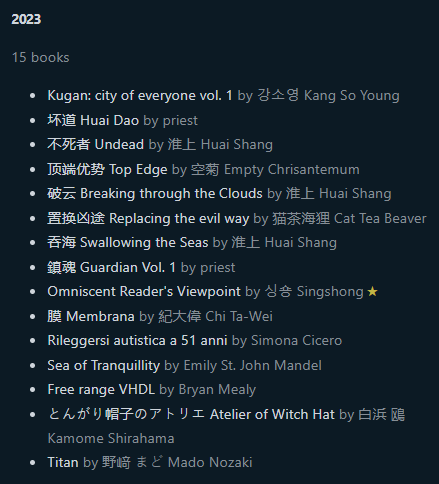

commenti e note sui libri letti quest'anno senza un ordine preciso: 
- ORV libro che ha segnato quest'anno. Sbirciando il fandom (e soprattutto le fanart) immaginavo che mi sarebbe piaciuto visto che ho scoperto di trovare il genere unlimited flow + power system da litrpg molto enjoyable, ma non mi aspettavo che mi avrebbe preso in pieno come un camion. 
- Dopo ORV ho avuto bisogno prendere un po' di distanza dal fantasy e mi sono data ai gialli/thriller/mistery 
- 
